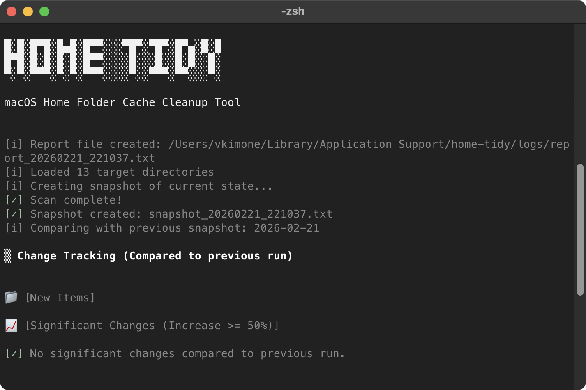

[English Version](./README.md)

# 🧹 Home-Tidy

**Home-Tidy**는 macOS 사용자를 위한 스마트한 홈 폴더(`~/`) 캐시 정리 도구입니다. 단순한 파일 삭제를 넘어, 분석 결과를 리포트로 제공합니다.



---

## ✨ 주요 기능

- **📊 스냅샷 기반 분석**: 실행 전후의 파일 시스템 상태를 스냅샷으로 기록하여 변경 사항을 추적합니다.
- **🛡️ 안전한 정리**: 필수 시스템 파일과 설정 폴더를 보호하는 화이트리스트 기능을 지원합니다.
- **🚀 고성능 스캔**: 대규모 디렉토리를 효율적으로 분석하도록 설계되었습니다.
- **📝 리포트 생성**: 정리된 항목과 확보된 용량을 상세한 리포트로 기록합니다.

---

## 📂 프로젝트 구조

```text
home-tidy/
├── home-tidy.sh      # 메인 실행 스크립트
├── config/           # 설정 파일 디렉토리
│   ├── target.conf     # 정리 대상 경로 설정
│   └── whitelist.conf  # 삭제 제외 패턴 설정
└── lib/              # 핵심 로직 (Bash 라이브러리)

# 실행 중 생성되는 파일 (macOS 표준 디렉토리)
~/Library/Application Support/home-tidy/
  ├── snapshots/  # 스냅샷 파일
  └── logs/       # 실행 리포트
```

> [!NOTE]
> 스냅샷과 리포트는 macOS 표준 경로에 저장됩니다. Homebrew 배포를 위한 설계입니다.

---

## 🚀 사용법

### 1. 사전 준비
스크립트에 실행 권한을 부여합니다.
```bash
chmod +x home-tidy.sh
```

### 2. 실행 옵션

| 옵션 | 설명 |
| :--- | :--- |
| `--execute` | **(기본값)** 실제 삭제를 수행합니다. |
| `--dry-run` | 실제 삭제 없이 어떤 파일이 삭제될지만 미리 보여줍니다. |
| `--compare-only` | 이전 스냅샷과 현재 상태의 차이점만 분석합니다. |
| `--list-target` | 현재 설정된 정리 대상 디렉토리 목록을 표시합니다. |
| `--list-whitelist` | 현재 설정된 화이트리스트 패턴 목록을 표시합니다. |
| `--section <name>` | 항목을 추가할 섹션 이름을 지정합니다. |
| `--add-target <p>` | 정리 대상 디렉토리 경로를 추가합니다. |
| `--remove-target <p>` | 정리 대상 디렉토리 경로를 제거합니다. |
| `--add-whitelist <w>` | 화이트리스트 패턴을 추가합니다. |
| `--remove-whitelist <w>` | 화이트리스트 패턴을 제거합니다. |
| `--version` | 버전 정보를 표시합니다. |
| `--verbose` | 상세 가동 로그를 출력합니다. |
| `--help` | 사용 가능한 도움말을 확인합니다. |

**예시:**
```bash
# 실제 정리 수행 (영구 삭제)
./home-tidy.sh

# 안전하게 미리보기
./home-tidy.sh --dry-run

# 명령행으로 정리 대상 디렉토리 관리
./home-tidy.sh --add-target ~/.test --section mysection
./home-tidy.sh --remove-target ~/.test

# 권한 문제가 발생하는 경우 (sudo 사용)
sudo ./home-tidy.sh
```

---

## 🛠️ 설정 가이드

### `config/target.conf`
정리하고자 하는 캐시 폴더 경로를 나열합니다. `~/`를 사용하여 홈 디렉토리 기준 경로를 지정할 수 있습니다.

### `config/whitelist.conf`
`target.conf`에 포함된 경로 중에서도 **절대 삭제하면 안 되는** 특정 파일이나 폴더 패턴을 정의합니다. (예: `com.apple.*`, `settings.json`)

---

## ⚠️ 주의사항

1. **전원 영구 삭제**: 보안상의 이유로 휴지통을 사용하지 않고 즉시 영구 삭제(`rm -rf`)합니다. 복구가 불가능하므로 주의하십시오.
2. **권한 문제 (Permission Denied)**: 일부 시스템 캐시나 보호된 폴더는 일반 권한으로 삭제할 수 없습니다. 이 경우 `sudo`를 사용하여 실행하십시오.
3. **Dry-run 권장**: 실제 삭제를 수행하기 전에 반드시 `--dry-run`으로 삭제 대상을 확인하세요.
4. **중요 데이터 제외**: `target.conf`에 프로젝트 소스 코드나 중요한 설정 파일이 포함되지 않도록 주의하세요.
5. **OS 호환성**: 이 도구는 **macOS 및 Bash 환경**에 최적화되어 있습니다.
6. **파일 저장 위치**: 스냅샷과 리포트는 `~/Library/Application Support/home-tidy`에 저장됩니다.


---

## 📦 설치 방법 (Homebrew)

Homebrew를 사용하면 **Home-Tidy**를 간편하게 설치하고 관리할 수 있습니다.

### 1. Tap 추가
```bash
brew tap vkimone/tap
```

### 2. 설치
```bash
brew install home-tidy
```

### 3. 업데이트
최신 버전으로 업데이트하려면 다음 명령어를 실행하세요:
```bash
brew update && brew upgrade home-tidy
```

---

## 📂 데이터 저장 위치

모든 설정과 기록은 다음 경로에 저장되며, 업데이트 시에도 유지됩니다.
- **경로**: `~/Library/Application Support/home-tidy`
- **설정 파일**: `config/` (사용자 정의 가능)
- **스냅샷**: `snapshots/`
- **리포트**: `logs/`

---

## 📜 라이선스
이 프로젝트는 개인적인 관리 도구로 제작되었습니다. 사용 시 발생하는 데이터 손실에 대해서는 책임지지 않으므로 충분히 테스트 후 사용하시기 바랍니다.
